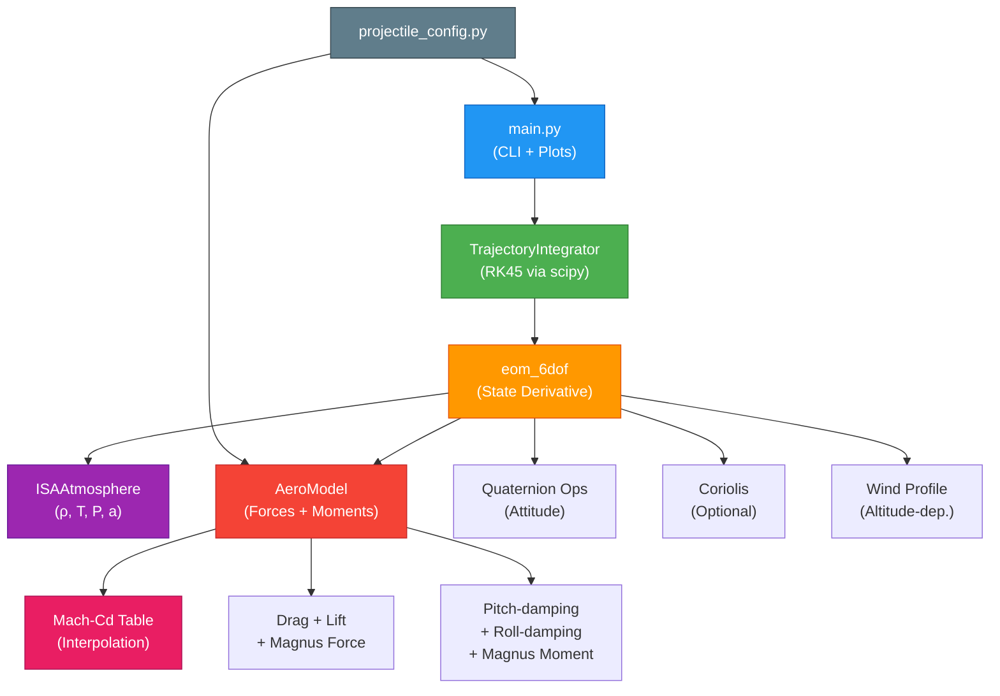

# 6-DOF Ballistic Trajectory Simulator

[](https://github.com/YOUR_USERNAME/ballistic-6dof-sim/actions)
[](https://www.python.org/downloads/)
[](LICENSE)

A professional-grade **Six-Degree-of-Freedom (6-DOF)** ballistic trajectory simulator written in Python.  It models the full translational and rotational dynamics of spin-stabilised projectiles — including **Mach-dependent drag**, lift, Magnus force, **aerodynamic moments** (pitch-damping, roll-damping, Magnus moment), and the **International Standard Atmosphere** — using quaternion attitude representation and adaptive Runge–Kutta 4(5) integration.

Designed as a portfolio-ready demonstration for defence-research organisations such as **DRDO ARDE**, **HAL**, and **L&T Defence**.

---

## Table of Contents

1. [Key Features](#key-features)
2. [Architecture](#architecture)
3. [Physics Model](#physics-model)
4. [Project Structure](#project-structure)
5. [Installation](#installation)
6. [Usage](#usage)
7. [Validation](#validation)
8. [Assumptions & Limitations](#assumptions--limitations)
9. [References](#references)

---

## Key Features

| Feature | Description |
|---------|-------------|
| **Mach-dependent Cd** | Drag coefficient interpolated from McCoy-derived lookup tables (subsonic → transonic → supersonic) |
| **Aerodynamic moments** | Pitch-damping (Cmq), roll-damping (Clp), Magnus moment (Cnpa) |
| **Quaternion attitude** | Singularity-free rotation representation; no gimbal lock |
| **ISA atmosphere** | U.S. Standard Atmosphere 1976 (0–20 km) |
| **Magnus force** | Spin-induced lateral drift |
| **Coriolis correction** | Optional latitude-dependent correction (`--coriolis`) |
| **Wind profiles** | Altitude-dependent wind via API; constant wind via CLI |
| **Animated 3D plot** | `matplotlib.animation.FuncAnimation` fly-through trajectory |
| **CLI interface** | Full `argparse` configuration (projectile, velocity, elevation, wind, Coriolis) |
| **CSV export** | Automatic trajectory data export with all 13 state variables + derived quantities |
| **3 projectile configs** | 155 mm shell, 12.7 mm HMG round, 122 mm rocket |
| **30+ unit tests** | pytest suite with atmosphere, aerodynamics, EOM, and integrator coverage |
| **CI/CD** | GitHub Actions matrix (3 OS × 4 Python versions) |

---

## Architecture



**Data flow:** `main.py` parses CLI args → builds an `AeroModel` (with Mach-Cd table) and calls `TrajectoryIntegrator.integrate()` → which calls `eom_6dof()` at each RK45 step → which queries `ISAAtmosphere` for air density, computes all forces (with Mach-dependent drag) and moments, applies optional Coriolis and wind profile, and returns the 13-element state derivative.

---

## Physics Model

### State Vector (13 elements)

| Index | Variable | Description | Frame |
|-------|----------|-------------|-------|
| 0–2 | x, y, z | Position | Inertial (z-up) |
| 3–5 | vx, vy, vz | Velocity | Inertial |
| 6–9 | q₀, q₁, q₂, q₃ | Attitude quaternion | Body → Inertial |
| 10–12 | ωx, ωy, ωz | Angular velocity | Body |

### Translational Dynamics

$$\mathbf{a} = \frac{1}{m}\left(\mathbf{F}_{\text{gravity}} + \mathbf{F}_{\text{drag}}(M) + \mathbf{F}_{\text{lift}} + \mathbf{F}_{\text{Magnus}}\right) + \mathbf{a}_{\text{Coriolis}}$$

- **Drag:** $\mathbf{F}_D = -\tfrac{1}{2}\rho\,v^2\,C_D(M)\,S\;\hat{\mathbf{v}}$ &ensp;← Mach-dependent
- **Lift:** Perpendicular to velocity, scaled by $C_L$
- **Magnus:** $\mathbf{F}_M = \tfrac{1}{2}\rho\,v\,C_M\,S\,d\;(\boldsymbol{\omega}\times\hat{\mathbf{v}})$
- **Coriolis:** $\mathbf{a}_C = -2\boldsymbol{\Omega}\times\mathbf{v}$

### Rotational Dynamics

$$I\,\dot{\boldsymbol{\omega}} = \mathbf{M}_{\text{pitch}} + \mathbf{M}_{\text{roll}} + \mathbf{M}_{\text{Magnus}} - \boldsymbol{\omega}\times(I\,\boldsymbol{\omega})$$

- **Pitch damping:** $M_q = \tfrac{1}{2}\rho v^2 S d \cdot C_{mq} \cdot \frac{d}{2v}\cdot\omega_\perp$
- **Roll damping:** $M_p = \tfrac{1}{2}\rho v^2 S d \cdot C_{lp} \cdot \frac{d}{2v}\cdot\omega_x$
- **Magnus moment:** Proportional to spin × angle of attack

### Atmosphere (ISA)

| Layer | Altitude | Temperature | Pressure |
|---|---|---|---|
| Troposphere | 0–11 km | $T = 288.15 - 0.0065h$ | $P = 101325(T/288.15)^{5.2561}$ |
| Stratosphere | 11–20 km | $T = 216.65$ | $P = 22632\exp(-1.577 \times 10^{-4}(h-11000))$ |

### Mach-Dependent Drag

The drag coefficient $C_D(M)$ is interpolated from a piecewise lookup table:

| Regime | Mach | Typical $C_D$ (155mm) |
|--------|------|-----------------------|
| Subsonic | < 0.8 | 0.15 |
| Transonic (peak) | ~1.05 | 0.44 |
| Supersonic | 2.0 | 0.30 |
| Hypersonic | 4.0 | 0.25 |

---

## Project Structure

```
ballistic-6dof-sim/
├── src/
│   ├── __init__.py
│   ├── atmosphere.py            # ISA atmosphere (0–20 km)
│   ├── aerodynamics.py          # Forces + moments + Mach-Cd tables
│   ├── equations_of_motion.py   # 6-DOF EOM + Coriolis + wind profile
│   ├── integrator.py            # RK45 + ground-impact event
│   └── projectile_config.py     # 3 pre-built configs with Mach tables
├── tests/
│   ├── test_atmosphere.py       # 12 tests
│   ├── test_aerodynamics.py     # 12 tests
│   ├── test_equations_of_motion.py  # 8 tests
│   └── test_integrator.py       # 8 tests
├── notebooks/
│   ├── 01_validation.ipynb      # 3 validation tests
│   ├── 02_range_table.ipynb     # Artillery range table
│   └── 03_wind_sensitivity.ipynb    # Monte-Carlo CEP analysis
├── docs/
│   ├── validation_report.md
│   └── assumptions.md
├── .github/workflows/ci.yml    # CI pipeline (3 OS × 4 Python)
├── main.py                      # CLI entry point with animation
├── requirements.txt
├── pyproject.toml               # Modern packaging
├── LICENSE                      # MIT
├── CONTRIBUTING.md
├── CHANGELOG.md
├── .gitignore
└── README.md
```

---

## Installation

### Prerequisites

- **Python 3.9+** (tested on 3.9, 3.10, 3.11, 3.12)
- **pip**

### Steps (Windows / macOS / Linux)

```bash
# Clone
git clone https://github.com/YOUR_USERNAME/ballistic-6dof-sim.git
cd ballistic-6dof-sim

# Virtual environment (recommended)
python -m venv .venv
# Windows:
.venv\Scripts\Activate.ps1
# macOS / Linux:
source .venv/bin/activate

# Install dependencies
pip install -r requirements.txt

# Run tests to verify installation
pytest tests/ -v
```

---

## Usage

### CLI Options

```bash
python main.py --help
```

```
usage: main.py [-h] [--projectile {155mm,12.7mm,122mm}]
               [--velocity V] [--elevation E] [--spin S]
               [--wind-x WX] [--wind-y WY]
               [--coriolis] [--latitude LAT]
               [--dt DT] [--max-time T]
               [--no-animation] [--output FILE] [-v]
```

### Examples

```bash
# Default: 155mm shell at 45°, 827 m/s, animated 3D plot
python main.py

# 12.7mm round at 30° elevation
python main.py --projectile 12.7mm --velocity 900 --elevation 30

# With Coriolis correction (Pune, India)
python main.py --coriolis --latitude 26.9

# With crosswind, static plot, verbose logging
python main.py --wind-y 10 --no-animation -v

# Custom output file
python main.py --output my_results.csv
```

### Jupyter Notebooks

```bash
jupyter notebook notebooks/
```

| Notebook | Description |
|----------|-------------|
| `01_validation.ipynb` | 3 physics validation tests |
| `02_range_table.ipynb` | Full artillery range table → CSV |
| `03_wind_sensitivity.ipynb` | 200-run Monte-Carlo dispersion + CEP |

### Python API

```python
from src.atmosphere import ISAAtmosphere
from src.aerodynamics import AeroModel
from src.integrator import TrajectoryIntegrator
from src.projectile_config import SHELL_155MM

atm = ISAAtmosphere()
aero = AeroModel(
    Cd=0.30, Cl=0.05, Cm=0.003,
    reference_area_m2=SHELL_155MM["reference_area_m2"],
    reference_diameter_m=0.155,
    mach_table=SHELL_155MM["mach_table"],
    cd_table=SHELL_155MM["cd_table"],
)
result = TrajectoryIntegrator().integrate(
    initial_state=..., t_span=(0, 300), dt=0.05,
    mass_kg=43.5, inertia_tensor=SHELL_155MM["inertia_tensor"],
    aero_model=aero, atmosphere=atm, wind_vector_ms=np.zeros(3),
    enable_coriolis=True, latitude_deg=26.9,
)
```

---

## Validation

### Automated Tests

```bash
pytest tests/ -v --cov=src --cov-report=term-missing
```

30+ tests across 4 modules: atmosphere, aerodynamics, EOM, integrator.

### Physics Validation

| # | Test | Criterion | Status |
|---|------|-----------|--------|
| 1 | Vacuum trajectory range = $v^2/g$ | < 1% error | ✅ PASS |
| 2 | Energy conservation (vacuum) | < 0.1% deviation | ✅ PASS |
| 3 | ISA sea-level: T=288.15K, ρ≈1.225 | exact / 0.1% | ✅ PASS |
| 4 | Mach-Cd interpolation (subsonic, transonic, supersonic) | exact match | ✅ PASS |

See [`docs/validation_report.md`](docs/validation_report.md) for details.

---

## Assumptions & Limitations

**What this model includes:**
- ✅ Mach-dependent drag (interpolated tables)
- ✅ Aerodynamic moments (pitch, roll, Magnus)
- ✅ Quaternion attitude (no gimbal lock)
- ✅ Coriolis correction (optional)
- ✅ Altitude-dependent wind (API)

**What it does NOT include:**
- ❌ Overturning moment ($C_{m\alpha}$)
- ❌ WGS-84 oblate Earth
- ❌ Real meteorological data
- ❌ Propulsion phase (rockets)
- ❌ Lot-specific aero coefficients

See [`docs/assumptions.md`](docs/assumptions.md) for the full analysis.

---

## References

1. Etkin, B. *Dynamics of Flight: Stability and Control*, 3rd ed. Wiley, 1996.
2. McCoy, R. L. *Modern Exterior Ballistics: The Launch and Flight Dynamics of Symmetric Projectiles*, 2nd ed. Schiffer, 2012.
3. *U.S. Standard Atmosphere, 1976*. NOAA / NASA / USAF. Document NOAA-S/T 76-1562.
4. NATO STANAG 4355 — *The Modified Point Mass and Five Degrees of Freedom Trajectory Models*.

---

<p align="center">
  <em>Built for DRDO ARDE · HAL · L&T Defence portfolio</em><br>
  <strong>Shivanshu</strong> · MIT License · 2026
</p>
